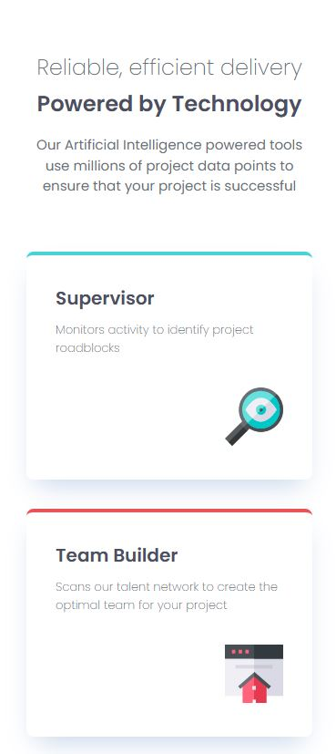
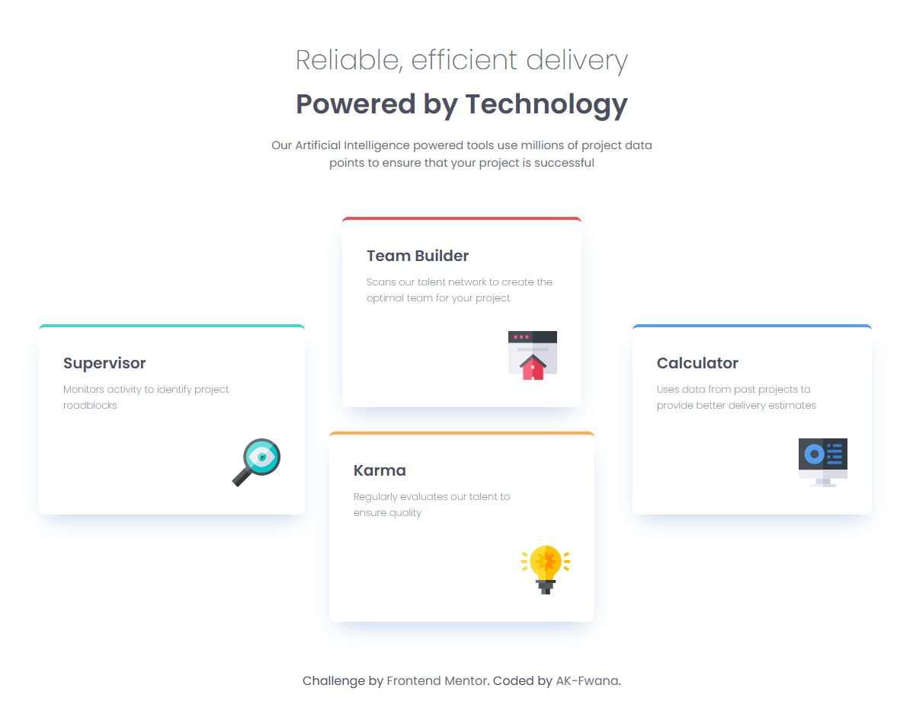

# Frontend Mentor - Four card feature section solution

This is my solution to the Four card feature section challenge on Frontend Mentor. The goal of this challenge was to build a responsive product card component that matches the provided design as closely as possible while following a mobile-first workflow.

## Table of contents

- [Overview](#overview)
  - [The challenge](#the-challenge)
  - [Screenshot](#screenshot)
  - [Links](#links)
- [My process](#my-process)
  - [Built with](#built-with)
  - [What I learned](#what-i-learned)
  - [Continued development](#continued-development)
  - [Useful resources](#useful-resources)
  - [AI Collaboration](#ai-collaboration)
- [Author](#author)

## Overview

### The challenge

Users should be able to:

- View the optimal layout for the site depending on their device's screen size

### Screenshot

### Links

- Solution URL: ()
- Live Site URL: ()

## My process

### Built with

- Semantic HTML5 markup
- CSS custom properties
- Flexbox
- CSS Grid
- Mobile-first workflow
- Responsive design

**Note: These are just examples. Delete this note and replace the list above with your own choices**

### What I learned

During this project, I improved my understanding of responsive layouts using CSS Grid and Flexbox. I also learned how to structure a project using a mobile-first workflow and how to use spacing tokens and CSS custom properties to create scalable styles.

One of the biggest lessons was understanding when to use Grid for page layout and Flexbox for component alignment.

### Continued development

In future projects, I want to continue improving my responsive design skills and become more confident with advanced Grid layouts and accessibility best practices.

### Useful resources

- [web.dev ](https://web.dev/?hl=en) - Helped me practice responsive frontend development with realistic projects.
- [MDN Web Docs](https://developer.mozilla.org/) - Helped me better understand CSS Grid, Flexbox, and responsive design concepts.

### AI Collaboration

During this project, I used ChatGPT to help guide my development process. AI tools helped me:

- debug layout issues,
- understand responsive design concepts,
- structure scalable CSS,
- improve semantic HTML,
- and refine accessibility practices.

The most useful part was learning the reasoning behind layout decisions instead of only copying solutions.

## Author

- GitHub - [AK-Fwana](https://github.com/AK-Fwana)
- Frontend Mentor - [@AK-Fwana](https://www.frontendmentor.io/profile/AK-Fwana)
